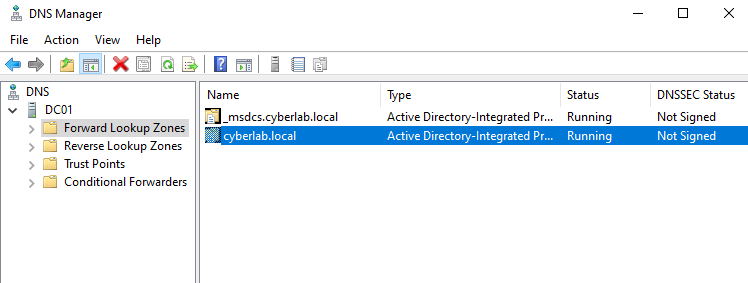
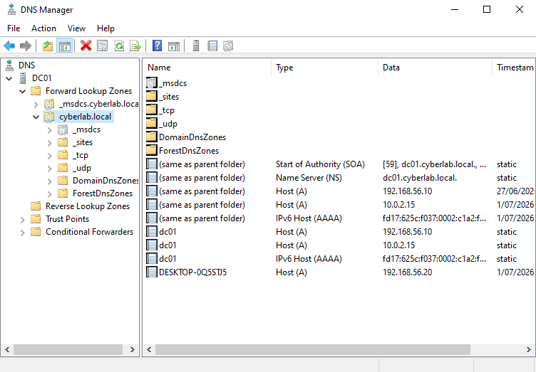
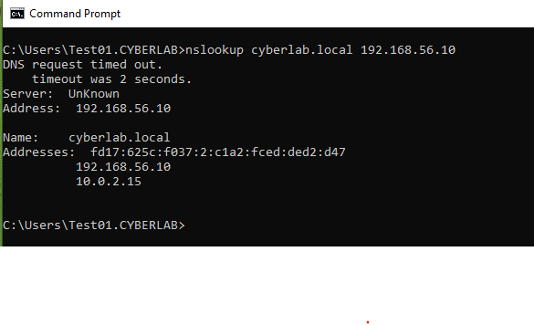

# DNS

## Overview

This section documents the configuration and verification of the Active Directory-integrated DNS service within the **cyberlab.local** domain. DNS provides name resolution for domain services, enabling clients to locate the Domain Controller and authenticate successfully.

## Objectives

- Verify Active Directory-integrated DNS
- Confirm Forward Lookup Zones were created
- Validate DNS records
- Verify DNS resolution from a domain-joined client

## Environment

- Windows Server 2022
- Active Directory Domain Services (AD DS)
- DNS Server
- DNS Manager
- Windows 10 Enterprise
- VirtualBox

## Activities Performed

- Verified the Active Directory-integrated Forward Lookup Zones.
- Confirmed DNS records were automatically created for the domain.
- Validated host records for the Domain Controller and domain-joined client.
- Performed DNS resolution testing from the Windows 10 client.

## Verification

The DNS configuration was verified by confirming:

- The **cyberlab.local** Forward Lookup Zone was present.
- Active Directory DNS records were successfully created.
- The Domain Controller and client host records were registered.
- Domain name resolution was successful from the Windows 10 client.

---

## Screenshots

### Forward Lookup Zones

DNS Manager showing the Active Directory-integrated Forward Lookup Zones for the **cyberlab.local** domain.

---

### DNS Zone Records

DNS Manager displaying the DNS records created for the **cyberlab.local** domain, including the Domain Controller and client host records.

---

### DNS Verification

Command Prompt confirming successful DNS resolution for the **cyberlab.local** domain from the Windows 10 client.

