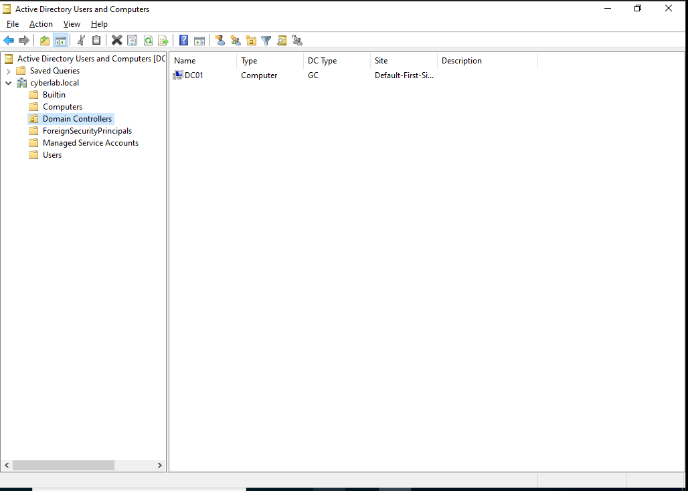

# Domain Controller Setup

## Overview

This section documents the deployment of a Windows Server 2022 Domain Controller for the **cyberlab.local** Active Directory environment. Active Directory Domain Services (AD DS) and DNS Server were configured to provide centralized authentication, directory services, and name resolution throughout the lab.

## Objectives

- Deploy a Windows Server 2022 Domain Controller
- Configure the **cyberlab.local** Active Directory domain
- Install and configure Active Directory Domain Services (AD DS)
- Install and configure the DNS Server role
- Verify successful Domain Controller deployment

## Environment

- Windows Server 2022
- Active Directory Domain Services (AD DS)
- DNS Server
- VirtualBox

## Activities Performed

- Installed the Active Directory Domain Services (AD DS) role.
- Installed and configured the DNS Server role.
- Promoted the server to a Domain Controller.
- Created the **cyberlab.local** Active Directory domain.
- Verified successful Domain Controller deployment using Active Directory administrative tools.

## Verification

The deployment was verified by confirming:

- The **cyberlab.local** domain was successfully created.
- The Domain Controller (**DC01**) was present within the Domain Controllers container.
- Active Directory administrative tools were available and functioning correctly.

---

## Screenshots

### Active Directory Domain

Active Directory Users and Computers showing the **cyberlab.local** domain and the **DC01** Domain Controller after successful deployment.

