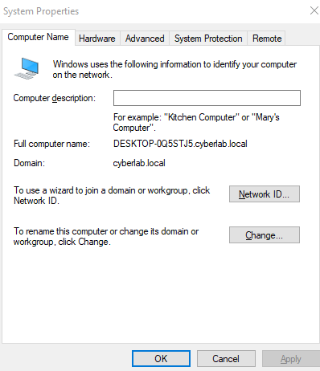
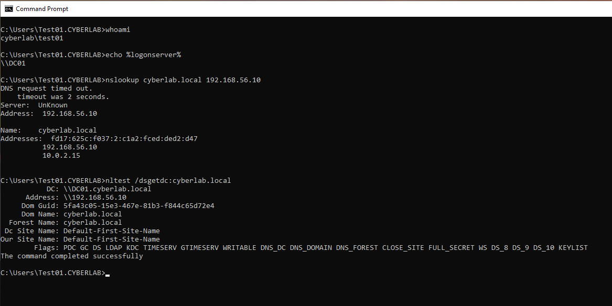

# Domain Join

## Overview

This section documents the process of joining a Windows 10 Enterprise client to the **cyberlab.local** Active Directory domain. The client was configured to use the Domain Controller for authentication and DNS resolution, allowing centralized user authentication and management.

## Objectives

- Join a Windows 10 Enterprise client to the Active Directory domain
- Verify successful domain authentication
- Confirm communication with the Domain Controller
- Validate DNS name resolution

## Environment

- Windows Server 2022 Domain Controller
- Windows 10 Enterprise
- Active Directory Domain Services (AD DS)
- DNS Server
- VirtualBox

## Activities Performed

- Configured the Windows 10 client to use the Domain Controller as its DNS server.
- Joined the client to the **cyberlab.local** domain.
- Logged in using a domain user account.
- Verified authentication against the Domain Controller.
- Confirmed DNS resolution and Domain Controller discovery from the client.

## Verification

The domain join was verified by confirming:

- The Windows 10 client was joined to the **cyberlab.local** domain.
- Domain user authentication was successful.
- The client authenticated against **DC01**.
- DNS successfully resolved the Active Directory domain.

---

## Screenshots

### Windows 10 Joined to Domain

System Properties confirming the Windows 10 client is joined to the **cyberlab.local** Active Directory domain.

---

### Domain Join Verification

Command Prompt verifying successful domain authentication, Domain Controller discovery, and DNS resolution.

Commands shown:

- `whoami`
- `echo %logonserver%`
- `nslookup cyberlab.local`
- `nltest /dsgetdc:cyberlab.local`

