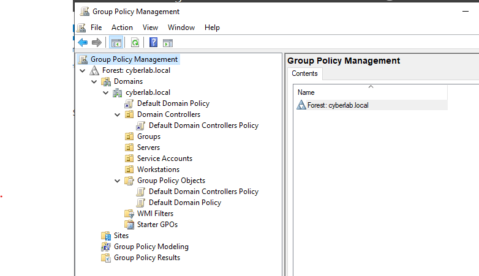
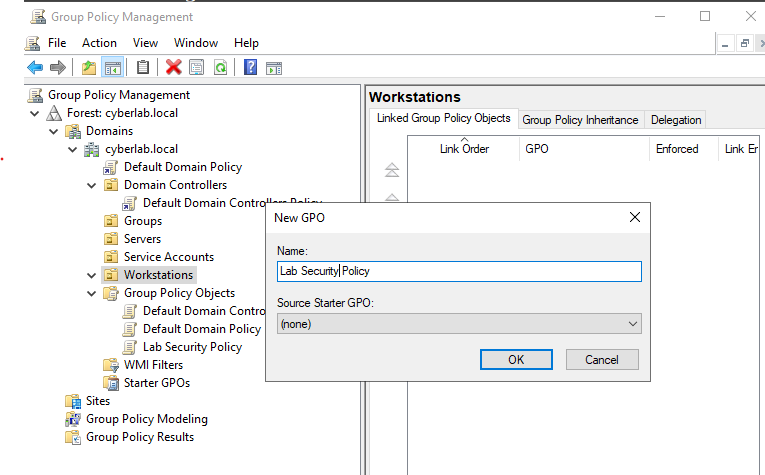
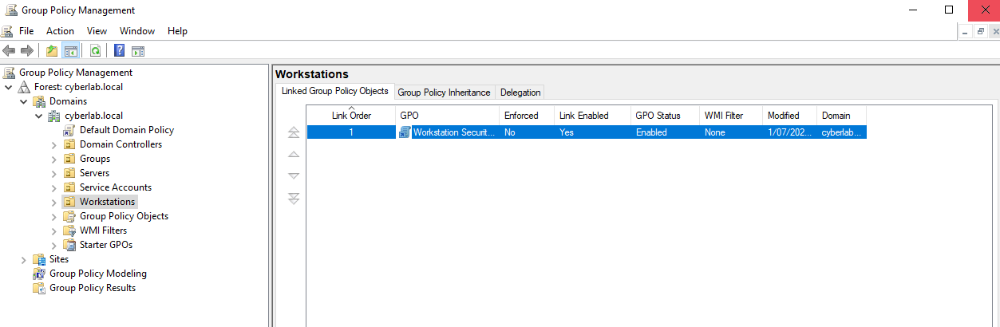
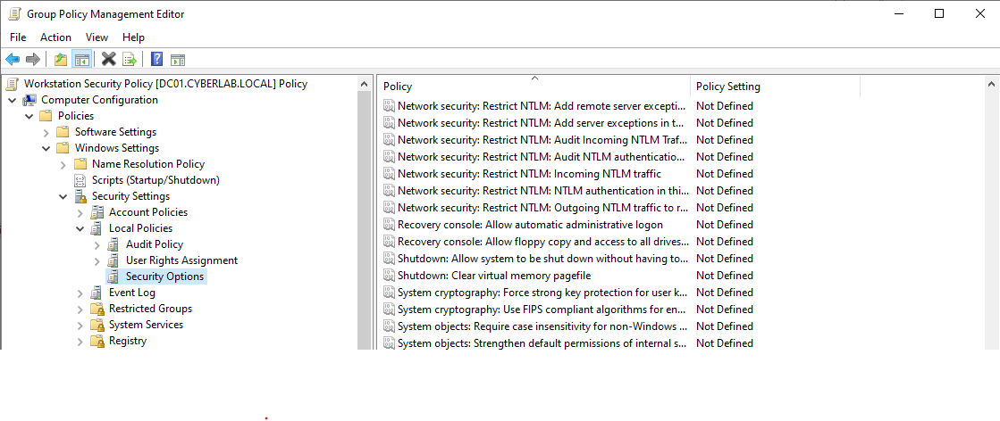
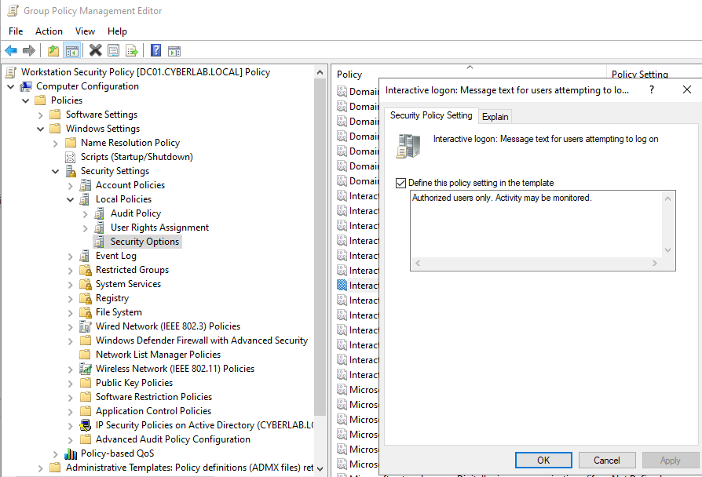

# Group Policy

## Overview

This section documents the creation and deployment of Group Policy Objects (GPOs) within the **cyberlab.local** Active Directory environment. A dedicated Group Policy Object was created and linked to the **Workstations** Organizational Unit to centrally manage workstation security settings.

## Objectives

- Create a Group Policy Object (GPO)
- Link the GPO to an Organizational Unit
- Configure workstation security settings
- Verify successful Group Policy configuration

## Environment

- Windows Server 2022
- Active Directory Domain Services (AD DS)
- Group Policy Management Console (GPMC)
- Group Policy Management Editor
- VirtualBox

## Activities Performed

- Opened the Group Policy Management Console.
- Created a new Group Policy Object named **Workstation Security Policy**.
- Linked the Group Policy Object to the **Workstations** Organizational Unit.
- Modified security settings using the Group Policy Management Editor.
- Configured an interactive logon message for workstation users.

## Verification

The configuration was verified by confirming:

- The Group Policy Object was successfully created.
- The policy was linked to the **Workstations** Organizational Unit.
- Security settings were successfully configured within the policy.
- The configured policy settings were saved and available for deployment.

---

## Screenshots

### Group Policy Management

The Group Policy Management Console showing the Active Directory Group Policy structure.

---

### Creating the Group Policy Object

Creating the **Workstation Security Policy** Group Policy Object.

---

### Linked Group Policy Object

The **Workstation Security Policy** successfully linked to the **Workstations** Organizational Unit.

---

### Editing Group Policy

Editing security settings within the **Workstation Security Policy** using the Group Policy Management Editor.

---

### Configured Security Policy

The configured interactive logon message within the Group Policy.

