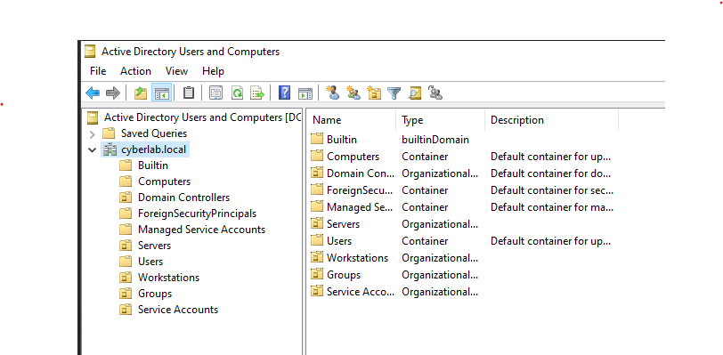
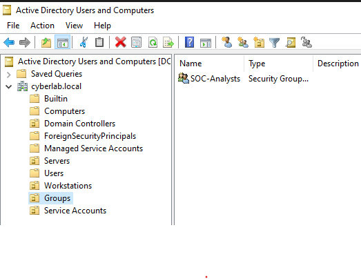

# Organizational Units

## Overview

This section documents the creation and organization of Organizational Units (OUs) within the **cyberlab.local** Active Directory environment. OUs were used to logically separate users, groups, workstations, servers, and service accounts, providing a structured hierarchy for administration and the application of Group Policy.

## Objectives

- Create Organizational Units (OUs)
- Organize Active Directory objects into logical containers
- Prepare the environment for Group Policy deployment
- Improve administrative organization

## Environment

- Windows Server 2022
- Active Directory Domain Services (AD DS)
- Active Directory Users and Computers (ADUC)
- VirtualBox

## Activities Performed

- Created Organizational Units for:
  - Groups
  - Servers
  - Service Accounts
  - Workstations
- Organized Active Directory objects into their respective OUs.
- Moved the **SOC-Analysts** security group into the **Groups** Organizational Unit.

## Verification

The configuration was verified by confirming:

- Organizational Units were successfully created.
- Active Directory objects were organized into the correct OUs.
- The **SOC-Analysts** security group was successfully located within the **Groups** OU.

---

## Screenshots

### Organizational Unit Structure

Active Directory Users and Computers showing the Organizational Unit structure created within the **cyberlab.local** domain.

---

### Groups Organizational Unit

The **Groups** Organizational Unit containing the **SOC-Analysts** security group.

