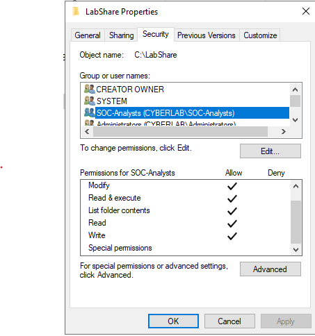
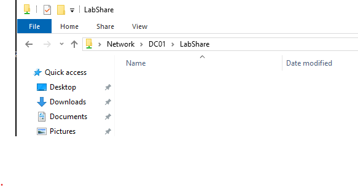

# Shared Folder Permissions

## Overview

This section documents the configuration of a shared network folder secured using Active Directory security groups. NTFS permissions were assigned to the **SOC-Analysts** security group, allowing access to be managed through group membership rather than individual user accounts.

## Objectives

- Create a shared network folder
- Configure NTFS permissions
- Assign permissions to an Active Directory security group
- Verify access from a domain-joined client

## Environment

- Windows Server 2022
- Active Directory Domain Services (AD DS)
- Windows 10 Enterprise
- SMB File Sharing
- VirtualBox

## Activities Performed

- Created a shared folder named **LabShare**.
- Configured NTFS permissions for the shared folder.
- Granted the **SOC-Analysts** security group the appropriate permissions.
- Verified that a domain-joined client could successfully access the shared folder.

## Verification

The shared folder configuration was verified by confirming:

- NTFS permissions were successfully assigned to the **SOC-Analysts** security group.
- Access control was managed through Active Directory group membership.
- The shared folder was accessible from the Windows 10 domain-joined client.

---

## Screenshots

### NTFS Permissions

The **SOC-Analysts** Active Directory security group assigned NTFS permissions to the shared folder.

---

### Network Share Access

Windows 10 successfully accessing the **LabShare** network share hosted on the Domain Controller.

