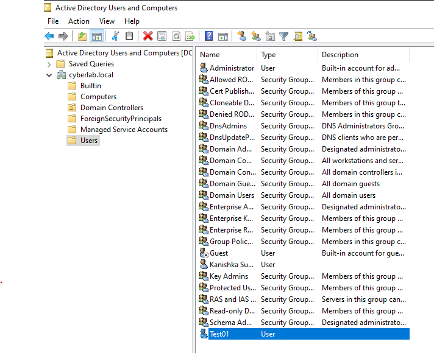
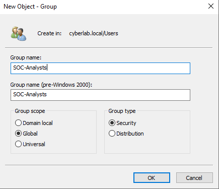
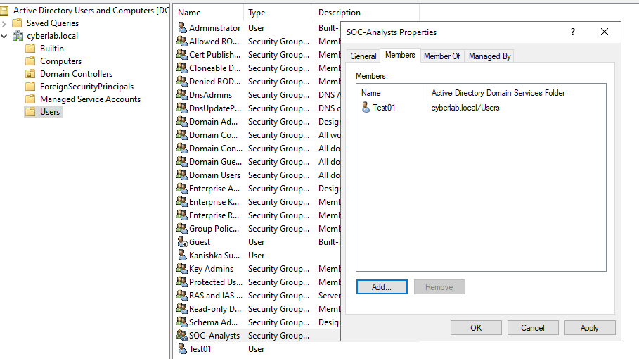
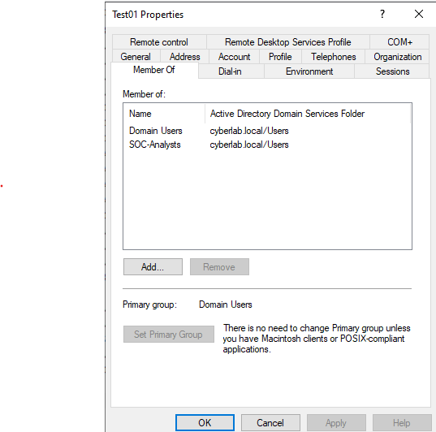

# Users & Groups

## Overview

This section documents the creation and management of Active Directory users and security groups within the **cyberlab.local** domain. Security groups were used to simplify permission management by assigning access rights to groups rather than individual user accounts.

## Objectives

- Create domain user accounts
- Create Active Directory security groups
- Assign users to security groups
- Verify group membership

## Environment

- Windows Server 2022
- Active Directory Domain Services (AD DS)
- Active Directory Users and Computers (ADUC)
- VirtualBox

## Activities Performed

- Created a domain user account.
- Created a Global Security Group named **SOC-Analysts**.
- Added the domain user to the security group.
- Verified the user's group membership within Active Directory.

## Verification

The configuration was verified by confirming:

- The domain user account was successfully created.
- The **SOC-Analysts** security group was created.
- The user was successfully added to the security group.
- Active Directory reflected the correct group membership.

---

## Screenshots

### Domain User Creation

Creating a domain user account within Active Directory Users and Computers.

---

### Security Group Creation

Creating the **SOC-Analysts** Global Security Group.

---

### Security Group Membership

The **SOC-Analysts** group showing **Test01** as a member.

---

### User Group Membership

The **Test01** user properties confirming membership in both **Domain Users** and **SOC-Analysts**.

