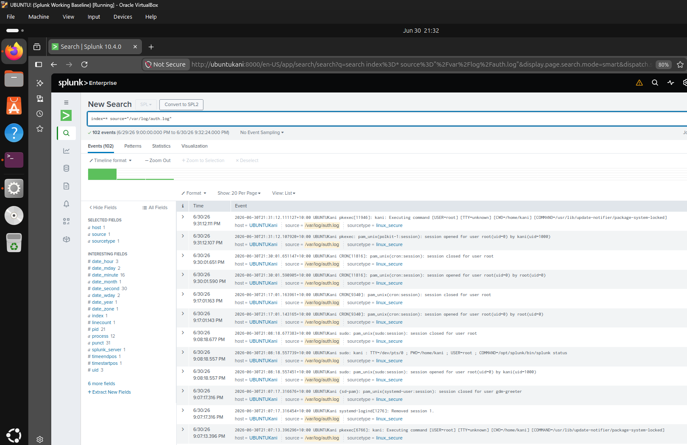
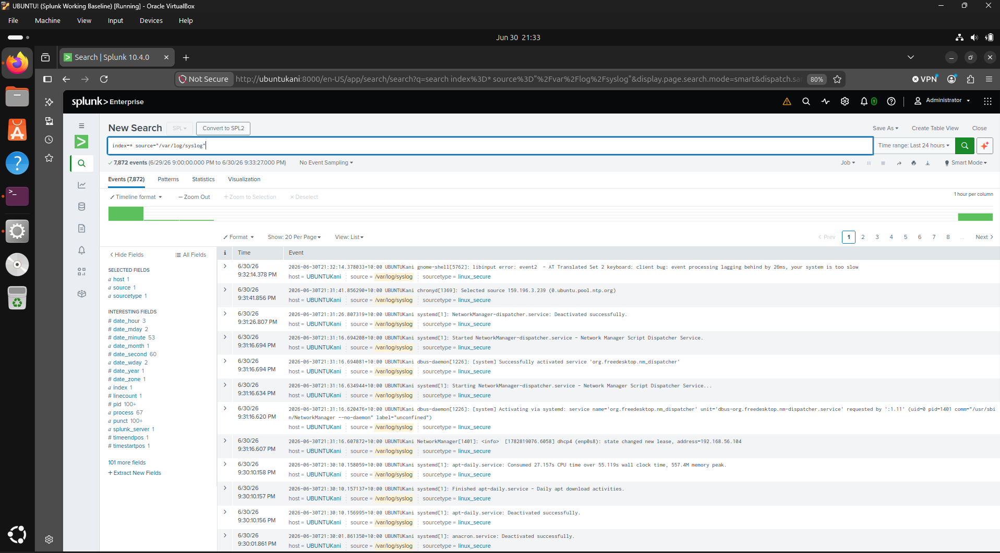

# Linux Log Collection

## Overview

This section documents the collection of Linux system logs from the Ubuntu Server running Splunk Enterprise. The logs are indexed in Splunk and are available for monitoring, troubleshooting, and security analysis.

---

## Objectives

- Configure Linux log collection
- Collect authentication and system logs
- Verify successful log ingestion
- Confirm Linux logs are searchable

---

## Environment

- Splunk Enterprise 10.4.0
- Ubuntu Server
- Oracle VirtualBox

---

## Activities Performed

- Configured Splunk Enterprise to monitor Linux log files.
- Added the following log sources:
  - `/var/log/auth.log`
  - `/var/log/syslog`
- Assigned the `linux_secure` sourcetype.
- Verified successful ingestion using SPL searches.

---

## Verification

The configuration was verified by confirming:

- Authentication logs were successfully indexed.
- System logs were successfully indexed.
- Linux log events could be searched using SPL.

---

# Screenshots

## Authentication Log Collection

Authentication events from `/var/log/auth.log` successfully collected and indexed by Splunk.

### SPL Query

```spl
index=* source="/var/log/auth.log"
```



---

## System Log Collection

System events from `/var/log/syslog` successfully collected and indexed by Splunk.

### SPL Query

```spl
index=* source="/var/log/syslog"
```


