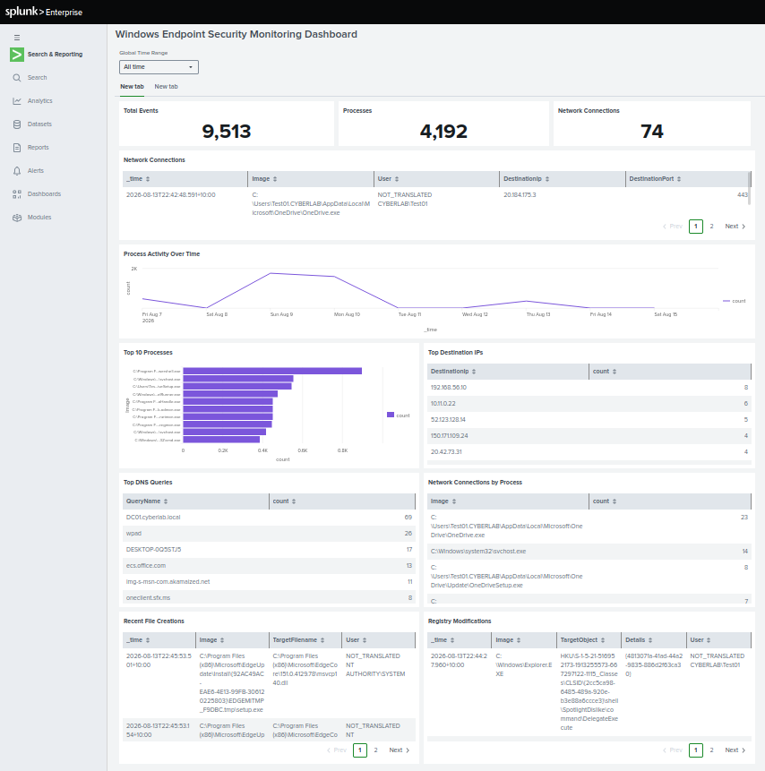

## Windows Endpoint Security Monitoring Dashboard

Built a Splunk dashboard to provide centralized visibility into Windows endpoint activity using Sysmon telemetry.

The dashboard provides visibility into:

- Total security events and process activity
- Network connections and destination IP addresses
- Process activity over time
- Most frequently executed processes
- DNS queries
- Network connections by process
- Recent file creation activity
- Windows Registry modifications

The dashboard uses Sysmon events forwarded from a Windows endpoint to Splunk Enterprise using the Splunk Universal Forwarder.

### Dashboard

