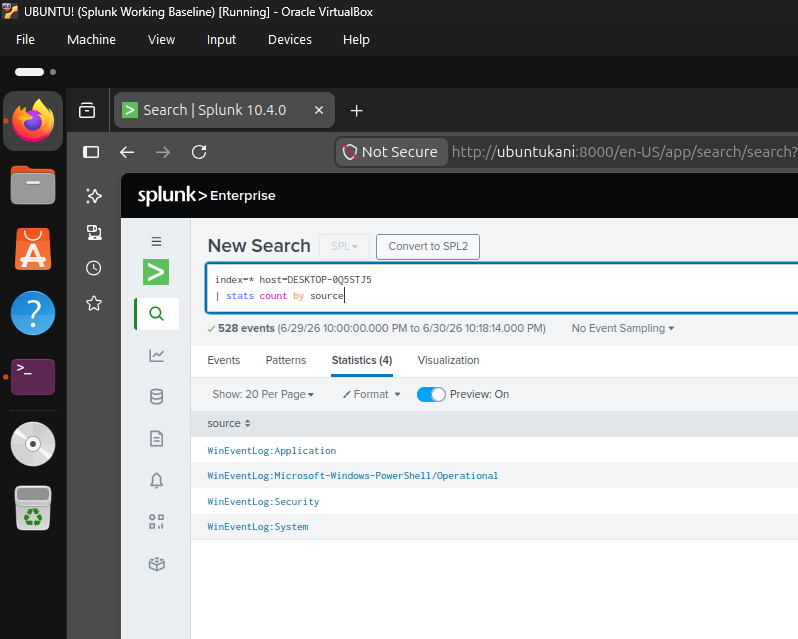

# Windows Log Collection

## Overview

This section documents the collection of Windows Event Logs from a domain-joined Windows 10 Enterprise system using the Splunk Universal Forwarder. The logs are forwarded to Splunk Enterprise where they can be searched and analysed for security monitoring.

---

## Objectives

- Configure the Splunk Universal Forwarder
- Forward Windows Event Logs to Splunk Enterprise
- Verify successful log ingestion
- Confirm Windows Event Logs are searchable

---

## Environment

- Splunk Enterprise 10.4.0
- Splunk Universal Forwarder
- Windows 10 Enterprise
- Ubuntu Server
- Oracle VirtualBox

---

## Activities Performed

- Installed the Splunk Universal Forwarder on the Windows 10 Enterprise VM.
- Configured the forwarder to send logs to the Splunk Enterprise server.
- Collected the following Windows Event Logs:
  - Security
  - System
  - Application
  - Microsoft-Windows-PowerShell/Operational
- Verified successful log ingestion using SPL searches.

---

## Verification

The configuration was verified by confirming:

- The Universal Forwarder was actively forwarding data.
- Windows Event Logs were successfully indexed in Splunk.
- Windows Event Logs could be searched using SPL.

---

# Screenshots

## Universal Forwarder Status

The Splunk Universal Forwarder successfully connected to the Splunk Enterprise server and was actively forwarding Windows Event Logs.


---

## Windows Event Sources

The following SPL search was used to verify that Windows Event Log sources were being collected from the Windows 10 Enterprise host.

### SPL Query

```spl
index=* host=DESKTOP-0Q5STJ5
| stats count by source
```

This confirms the collection of:

- WinEventLog:Security
- WinEventLog:System
- WinEventLog:Application
- Microsoft-Windows-PowerShell/Operational


