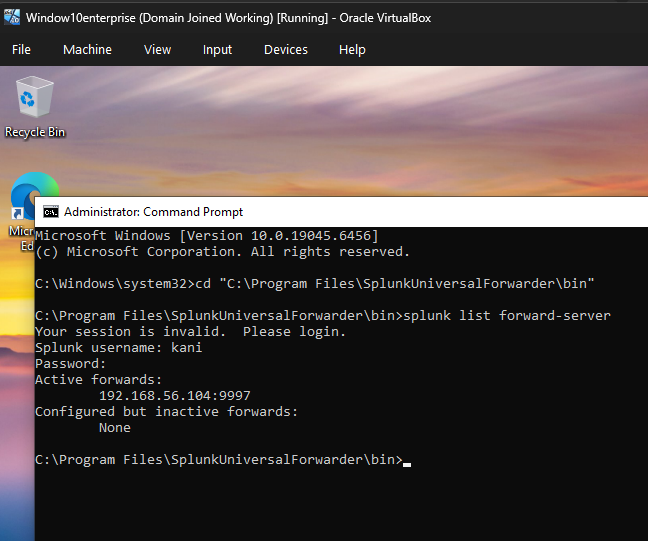
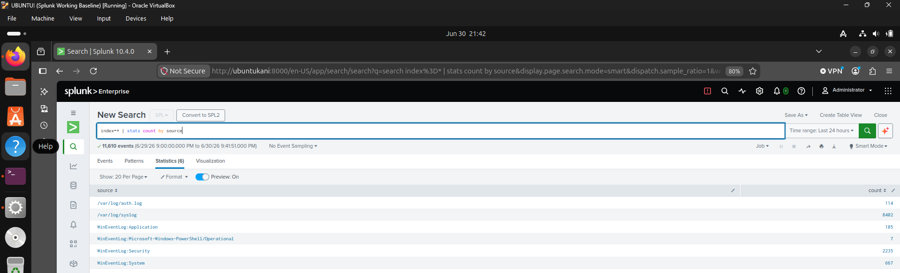

# Windows Log Collection

## Overview

This section documents the collection of Windows Event Logs from a domain-joined Windows 10 Enterprise system using the Splunk Universal Forwarder. The collected logs are indexed in Splunk Enterprise and are available for security monitoring and investigation.

## Objectives

- Configure the Splunk Universal Forwarder
- Forward Windows Event Logs to Splunk Enterprise
- Verify successful log ingestion
- Confirm Windows events are searchable

## Environment

- Splunk Enterprise 10.4.0
- Splunk Universal Forwarder
- Windows 10 Enterprise
- Ubuntu Server
- VirtualBox

## Activities Performed

- Installed the Splunk Universal Forwarder on the Windows 10 client.
- Configured the forwarder to send events to the Splunk Enterprise server.
- Collected Windows Event Logs, including:
  - Security
  - System
  - Application
  - Microsoft-Windows-PowerShell/Operational
- Verified successful ingestion using SPL searches.

## Verification

The configuration was verified by confirming:

- The Universal Forwarder was actively forwarding data.
- Windows Event Logs were indexed in Splunk.
- Event data from the Windows host was searchable.

---

## Screenshots

### Universal Forwarder Status

The Splunk Universal Forwarder successfully connected and actively forwarding data to the Splunk Enterprise server.

---

### Windows Event Sources

Splunk displaying the Windows Event Log sources being collected from the Windows 10 client.

---

### Windows Host Events

SPL search returning Windows Event Logs collected from the Windows 10 Enterprise host.

