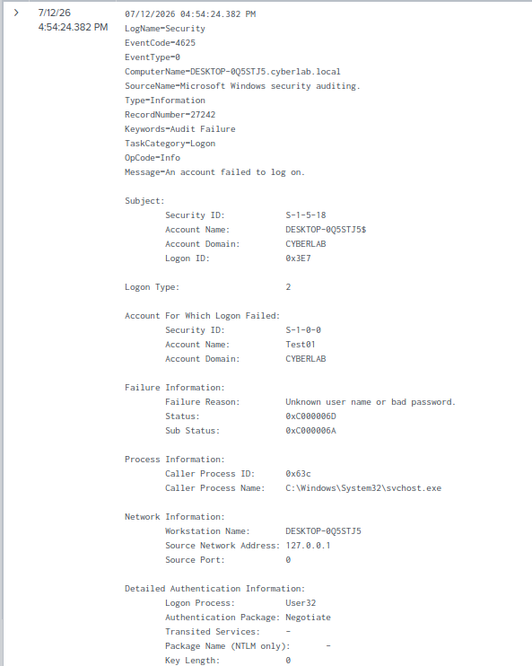
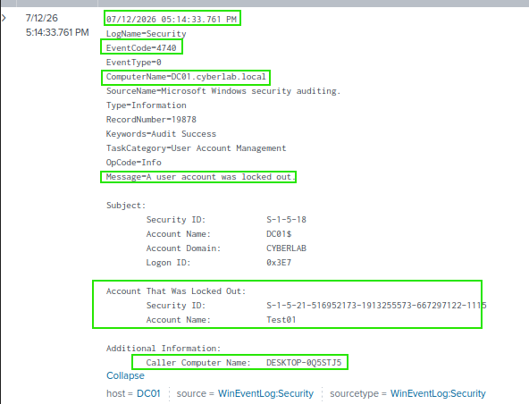
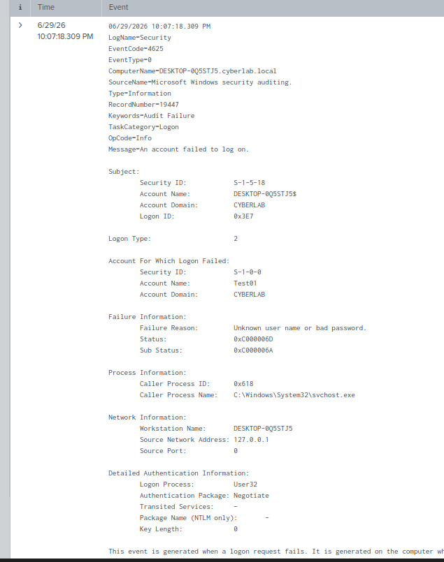
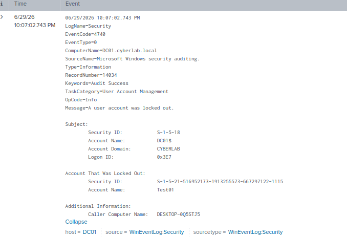

# Account Lockout Investigation

## Overview

This section documents the investigation of a Windows account lockout within an Active Directory environment. Multiple failed authentication attempts were generated to trigger the account lockout policy, resulting in Windows Security Event ID 4740. The investigation demonstrates how Splunk Enterprise can be used to identify the cause of the lockout and verify administrative remediation.

---

## Objectives

- Generate a Windows account lockout.
- Investigate failed authentication attempts.
- Identify the Windows Security Event generated during the lockout.
- Verify account recovery after administrative intervention.

---

## Environment

- Splunk Enterprise 10.4.0
- Splunk Universal Forwarder
- Windows Server 2022 Domain Controller
- Windows 10 Enterprise (Domain Joined)
- Active Directory Domain Services
- Oracle VirtualBox

---

## Event IDs Investigated

| Event ID | Description |
|----------|-------------|
| 4625 | Failed logon |
| 4740 | User account locked out |

---

## Activities Performed

- Generated multiple failed logon attempts using an incorrect password.
- Triggered the configured Active Directory account lockout policy.
- Investigated failed authentication events in Splunk.
- Confirmed the account lockout using Windows Security Event ID 4740.
- Unlocked the account using Active Directory Users and Computers.

---

## Verification

The investigation confirmed that:

- Multiple failed logon attempts generated Event ID 4625.
- The configured lockout threshold generated Event ID 4740.
- Splunk identified the affected user account and source workstation.
- The account was successfully unlocked by an administrator.

---

# Screenshots

## Failed Logon Events

Multiple failed authentication attempts were generated before the account lockout occurred.

### SPL Query

```spl
index=* EventCode=4625
```



---

## Account Lockout Event

Splunk identified Windows Security Event ID 4740 after the account exceeded the configured lockout threshold.

### SPL Query

```spl
index=* EventCode=4740
```



---

## Windows Account Lockout

The Windows client confirmed that the user account had been locked following multiple failed authentication attempts.



---

## Unlocking the User Account

The administrator unlocked the account using Active Directory Users and Computers, restoring access for the affected user.


