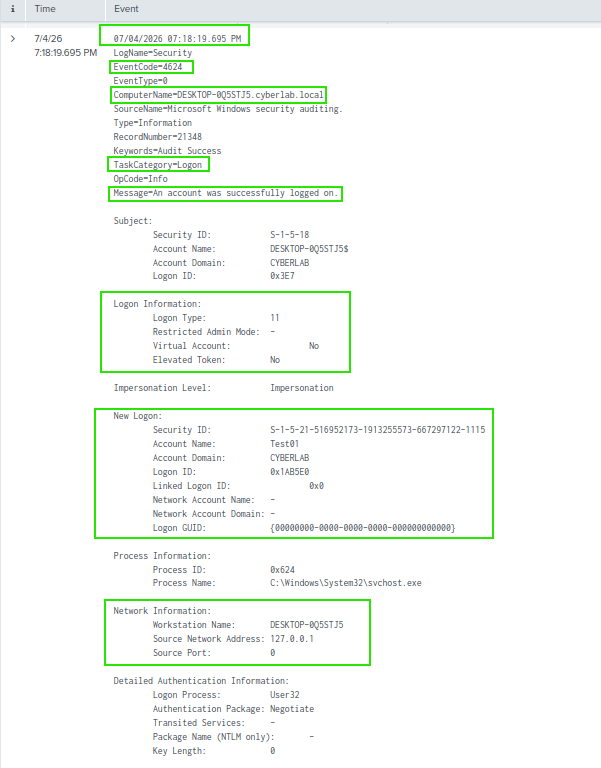
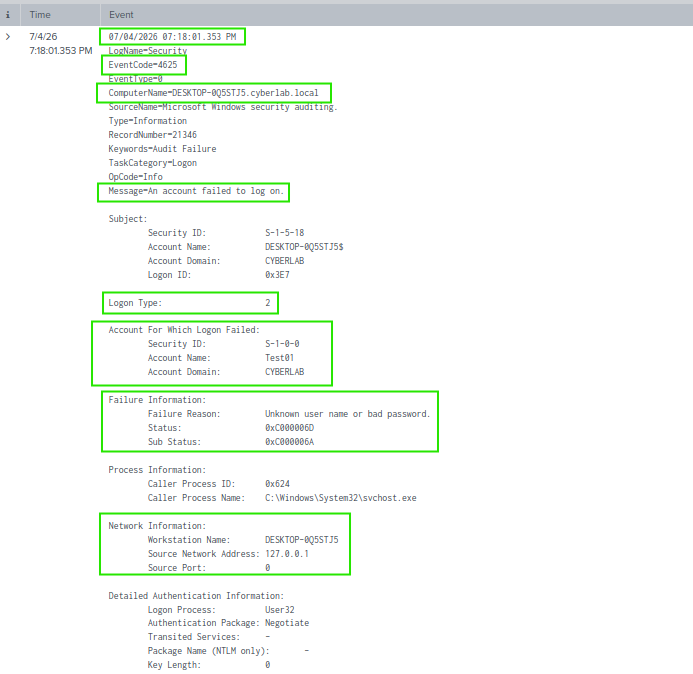

# Authentication Events

## Overview

This section demonstrates the monitoring and investigation of Windows authentication events collected from a domain-joined Windows 10 Enterprise system. Windows Security Event Logs were forwarded to Splunk Enterprise using the Splunk Universal Forwarder and analysed to identify successful and failed authentication attempts.

---

## Objectives

- Monitor Windows authentication activity.
- Investigate successful and failed logon events.
- Identify Windows Security Event IDs related to authentication.
- Verify authentication activity using Splunk Enterprise.

---

## Environment

- Splunk Enterprise 10.4.0
- Splunk Universal Forwarder
- Windows Server 2022 Domain Controller
- Windows 10 Enterprise (Domain Joined)
- Active Directory Domain Services
- Oracle VirtualBox

---

## Event IDs Investigated

| Event ID | Description |
|----------|-------------|
| 4624 | Successful logon |
| 4625 | Failed logon |

---

## Activities Performed

- Generated successful and failed logon attempts using the Test01 domain account.
- Collected Windows Security Event Logs using the Splunk Universal Forwarder.
- Searched authentication events using SPL.
- Investigated Event IDs 4624 and 4625.
- Verified authentication details including the user account, logon type and source workstation.

---

## Verification

The investigation confirmed that:

- Successful logon events generated Event ID 4624.
- Failed authentication attempts generated Event ID 4625.
- Splunk successfully recorded both authentication events.
- Authentication events included user account information, logon type and source workstation details.

---

# Screenshots

## Successful Logon

A successful authentication was generated by signing in with the **Test01** domain account. Splunk recorded Event ID 4624, showing the authenticated user, logon type and workstation.

### SPL Query

```spl
index=* EventCode=4624
```



> **Note:** This successful authentication was recorded as **Logon Type 11 (Cached Interactive)**, indicating that Windows authenticated the domain user using cached credentials. This is normal behaviour for a domain-joined Windows system.

---

## Failed Logon

An incorrect password was entered for the **Test01** domain account to generate a failed authentication event. Splunk recorded Event ID 4625, including the attempted username, failure reason, logon type and source workstation.

### SPL Query

```spl
index=* EventCode=4625
```


