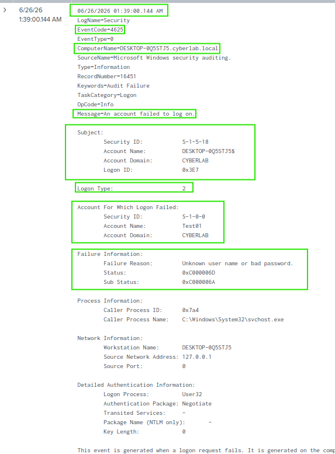

# Authentication Events

## Overview

This section demonstrates the investigation of Windows authentication events collected from a domain-joined Windows 10 Enterprise system. Authentication events are a primary source of security monitoring and help identify successful logons, failed authentication attempts, and potential brute-force activity.

---

## Objectives

- Monitor Windows authentication activity.
- Identify failed logon attempts.
- Investigate Windows Security Event IDs.
- Validate log collection using Splunk Enterprise.

---

## Environment

- Splunk Enterprise 10.4.0
- Splunk Universal Forwarder
- Windows Server 2022 Domain Controller
- Windows 10 Enterprise (Domain Joined)
- Active Directory Domain Services
- Oracle VirtualBox

---

## Event IDs Investigated

| Event ID | Description |
|----------|-------------|
| 4624 | Successful logon |
| 4625 | Failed logon |

---

## Activities Performed

- Generated successful and failed authentication attempts.
- Collected Windows Security Event Logs using the Splunk Universal Forwarder.
- Searched authentication events using SPL.
- Reviewed Windows Security Event ID 4625 to identify the failed logon reason.
- Verified the originating workstation and authentication details.

---

## Verification

The investigation verified that:

- Windows authentication events were successfully forwarded to Splunk.
- Failed logon attempts were searchable using SPL.
- Security Event ID 4625 contained detailed authentication information, including:
  - Username
  - Logon Type
  - Failure Reason
  - Source Workstation
  - Authentication Package

---

# Screenshots

## Failed Logon Search

The following SPL search was used to locate failed authentication events generated by the Windows 10 Enterprise system.

### SPL Query

```spl
index=* EventCode=4625
```



---

## Failed Logon Event (4625)

The failed authentication event provides detailed information including the attempted username, failure reason, logon type, source workstation, and authentication package used during the logon attempt.


