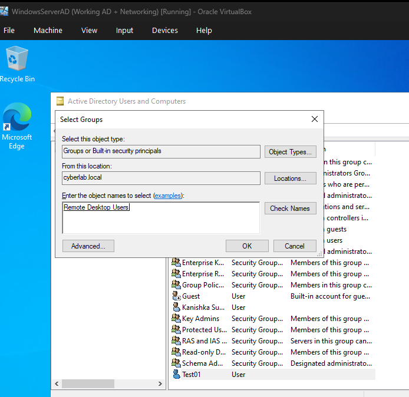
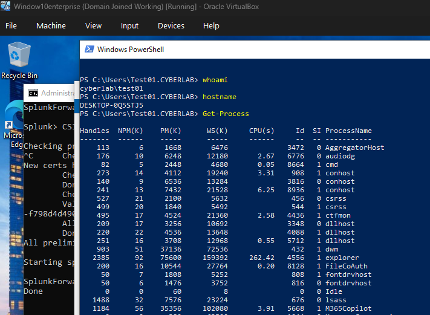

# Group Membership Changes

## Overview

This section demonstrates the monitoring and investigation of Active Directory group membership changes using Windows Security Event Logs. Group membership modifications were performed within Active Directory and verified using Splunk Enterprise to identify when users were added to or removed from security-enabled groups.

---

## Objectives

- Monitor Active Directory group membership changes.
- Investigate Windows Security Event IDs related to group membership.
- Verify administrative actions using Splunk Enterprise.
- Identify users added to and removed from security groups.

---

## Environment

- Splunk Enterprise 10.4.0
- Splunk Universal Forwarder
- Windows Server 2022 Domain Controller
- Windows 10 Enterprise (Domain Joined)
- Active Directory Domain Services
- Oracle VirtualBox

---

## Event IDs Investigated

| Event ID | Description |
|----------|-------------|
| 4732 | A member was added to a security-enabled local group |
| 4733 | A member was removed from a security-enabled local group |

---

## Activities Performed

- Added a user to the **Remote Desktop Users** security group.
- Verified the group membership change using Splunk.
- Removed the user from the security group.
- Confirmed the removal using Windows Security Event Logs.

---

## Verification

The investigation confirmed that:

- Event ID 4732 was generated when a user was added to a security-enabled local group.
- Event ID 4733 was generated when the user was removed.
- Splunk identified the affected user, group, and administrator account responsible for the change.

---

# Screenshots

## User Added to Security Group

The user was added to the **Remote Desktop Users** security group within Active Directory.



### SPL Query

```spl
index=* EventCode=4732
```


---

## User Removed from Security Group

The user was removed from the **Remote Desktop Users** security group.


### SPL Query

```spl
index=* EventCode=4733
```


