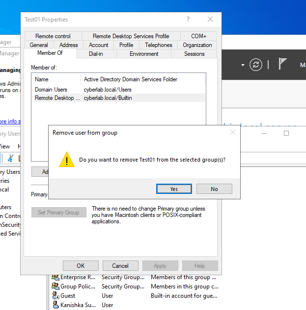
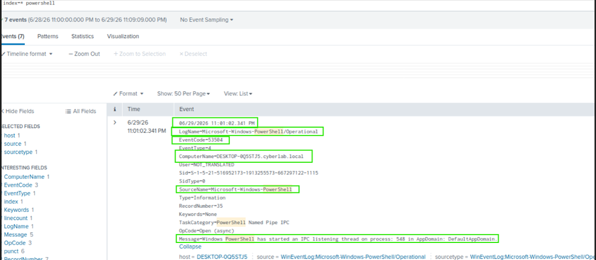

# PowerShell Activity

## Overview

This section demonstrates the monitoring and investigation of Windows PowerShell activity using the Microsoft-Windows-PowerShell/Operational event log. PowerShell logging provides visibility into command execution and administrative activity, making it an important source of information for security monitoring and incident investigations.

---

## Objectives

- Monitor PowerShell activity.
- Investigate PowerShell Operational events.
- Verify PowerShell logging using Splunk Enterprise.
- Identify executed PowerShell commands.

---

## Environment

- Splunk Enterprise 10.4.0
- Splunk Universal Forwarder
- Windows Server 2022 Domain Controller
- Windows 10 Enterprise (Domain Joined)
- Active Directory Domain Services
- Oracle VirtualBox

---

## Activities Performed

- Executed PowerShell commands on the Windows 10 Enterprise client.
- Collected Microsoft-Windows-PowerShell/Operational logs using the Splunk Universal Forwarder.
- Searched PowerShell Operational events using Splunk.
- Verified that executed commands were successfully recorded.

---

## Verification

The investigation confirmed that:

- PowerShell Operational logs were successfully collected.
- Splunk indexed PowerShell events.
- Executed PowerShell commands could be investigated using SPL.
- Event details included the executed command and associated user account.

---

# Screenshots

## PowerShell Command Execution

PowerShell commands were executed on the Windows 10 Enterprise client to generate PowerShell Operational events.



---

## PowerShell Operational Event

Splunk successfully collected Microsoft-Windows-PowerShell/Operational events generated by the executed PowerShell commands.

### SPL Query

```spl
index=* source="WinEventLog:Microsoft-Windows-PowerShell/Operational"
```


