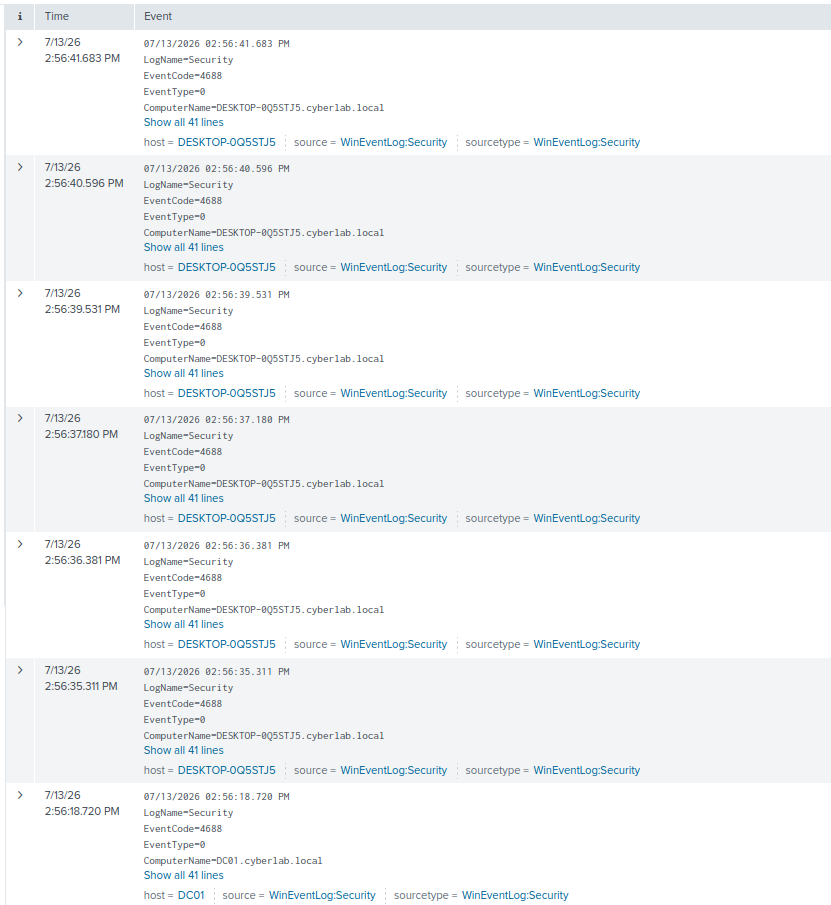
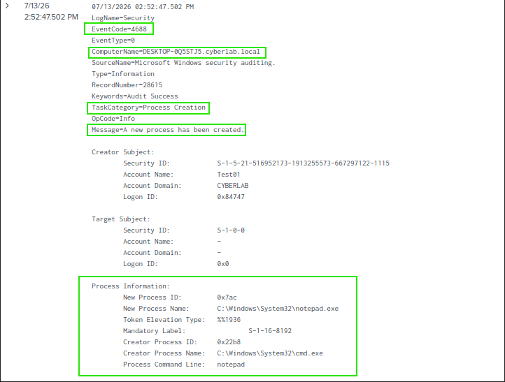

# Process Creation Monitoring

## Overview

This section demonstrates the monitoring and investigation of Windows process creation events using Windows Security Event ID 4688. Process creation logging provides visibility into applications executed on a system and is commonly used by Security Operations Centre (SOC) analysts to detect suspicious or unauthorized activity.

---

## Objectives

- Monitor Windows process creation events.
- Investigate Windows Security Event ID 4688.
- Identify executed processes using Splunk Enterprise.
- Validate process creation logging within the home lab.

---

## Environment

- Splunk Enterprise 10.4.0
- Splunk Universal Forwarder
- Windows Server 2022 Domain Controller
- Windows 10 Enterprise (Domain Joined)
- Active Directory Domain Services
- Oracle VirtualBox

---

## Event IDs Investigated

| Event ID | Description |
|----------|-------------|
| 4688 | A new process has been created |

---

## Activities Performed

- Enabled Windows process creation auditing.
- Executed applications on the Windows 10 Enterprise client.
- Collected Windows Security Event Logs using the Splunk Universal Forwarder.
- Investigated process creation events using Splunk Enterprise.
- Reviewed process details including the executable name and parent process.

---

## Verification

The investigation confirmed that:

- Windows generated Security Event ID 4688 when new processes were started.
- Splunk successfully indexed the process creation events.
- Process details such as the executable path and parent process were available for investigation.

---

# Screenshots

## Process Creation Search

The following SPL search was used to identify Windows process creation events.

### SPL Query

```spl
index=* EventCode=4688
```



---

## Event ID 4688 Details

Windows Security Event ID 4688 showing detailed information about a newly created process, including the process name, parent process, and user account responsible for launching the application.


