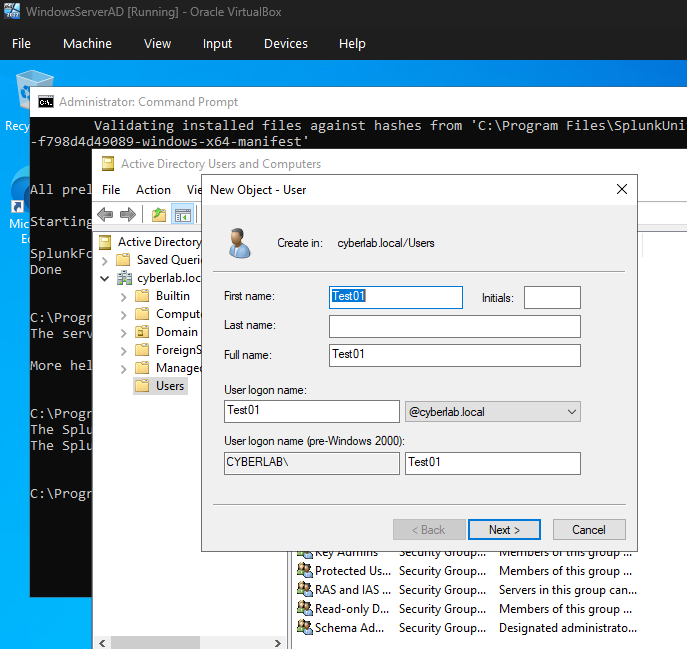
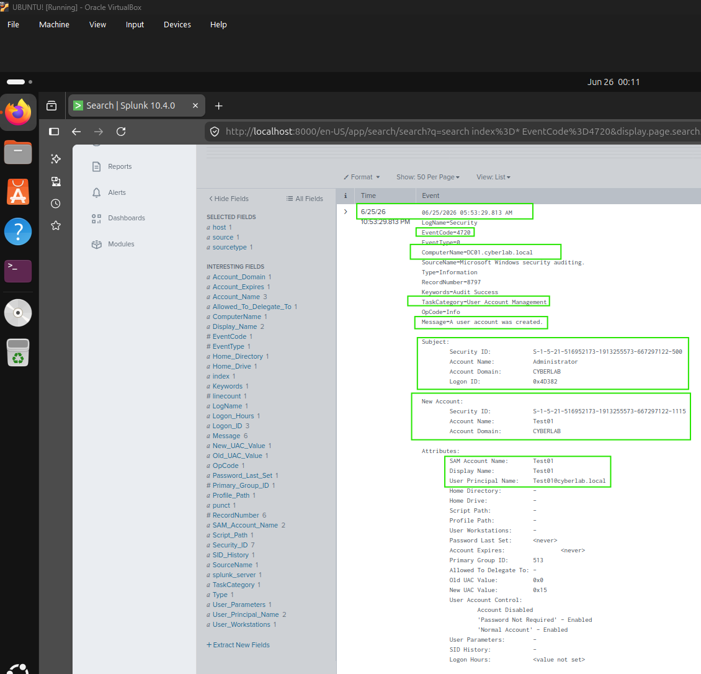
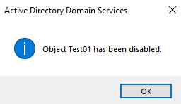
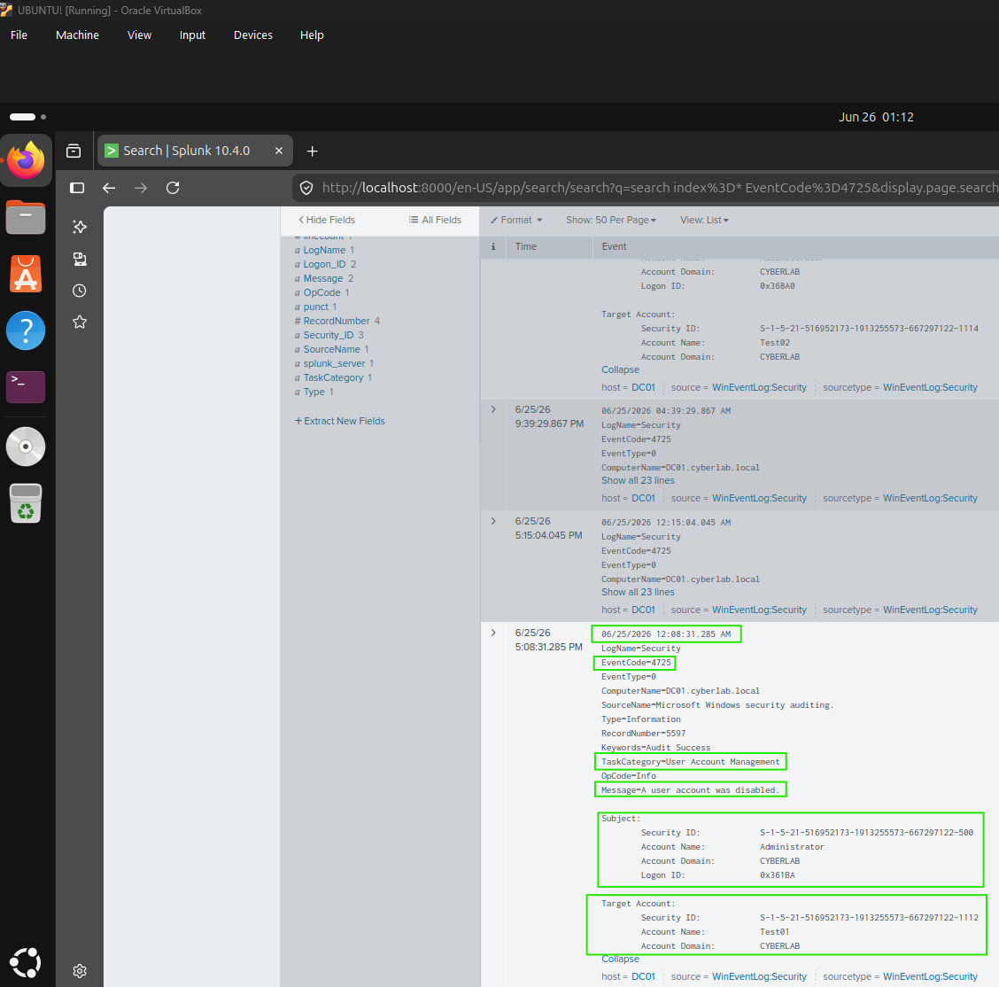
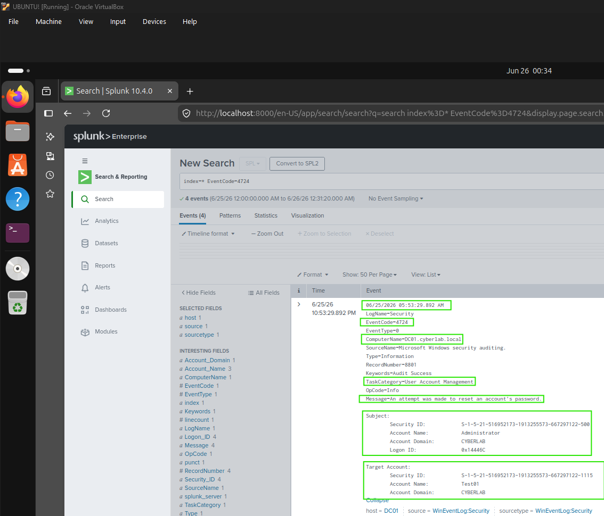
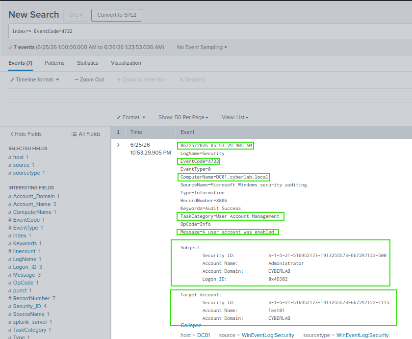

# User Account Management

## Overview

This section demonstrates the monitoring and investigation of user account management events within an Active Directory environment. Windows Security Event Logs were collected using the Splunk Universal Forwarder and analysed in Splunk Enterprise to verify common administrative actions such as user creation, account enablement, password resets, and account disablement.

---

## Objectives

- Monitor Active Directory user account management events.
- Identify Windows Security Event IDs related to account administration.
- Verify user management activity using Splunk Enterprise.
- Correlate administrative actions with Windows Security Event Logs.

---

## Environment

- Splunk Enterprise 10.4.0
- Splunk Universal Forwarder
- Windows Server 2022 Domain Controller
- Windows 10 Enterprise (Domain Joined)
- Active Directory Domain Services
- Oracle VirtualBox

---

## Event IDs Investigated

| Event ID | Description |
|----------|-------------|
| 4720 | User account created |
| 4722 | User account enabled |
| 4724 | Password reset attempted |
| 4725 | User account disabled |

---

## Activities Performed

- Created a new Active Directory user account.
- Enabled the user account.
- Reset the user's password.
- Disabled the user account.
- Verified each administrative action using Windows Security Event Logs collected in Splunk.

---

## Verification

The investigation confirmed that:

- User account creation generated Event ID 4720.
- Enabling the account generated Event ID 4722.
- Password reset activity generated Event ID 4724.
- Disabling the account generated Event ID 4725.
- All events contained the administrator account responsible for performing the action.

---

# Screenshots

## 1. User Account Created

### Active Directory



### SPL Query

```spl
index=* EventCode=4720
```

### Splunk Verification



---

## 2. User Account Disabled

### Active Directory



### SPL Query

```spl
index=* EventCode=4725
```

### Splunk Verification



---

## 3. Password Reset

### Active Directory


### SPL Query

```spl
index=* EventCode=4724
```

### Splunk Verification



---

## 4. User Account Enabled

### SPL Query

```spl
index=* EventCode=4722
```

### Splunk Verification


